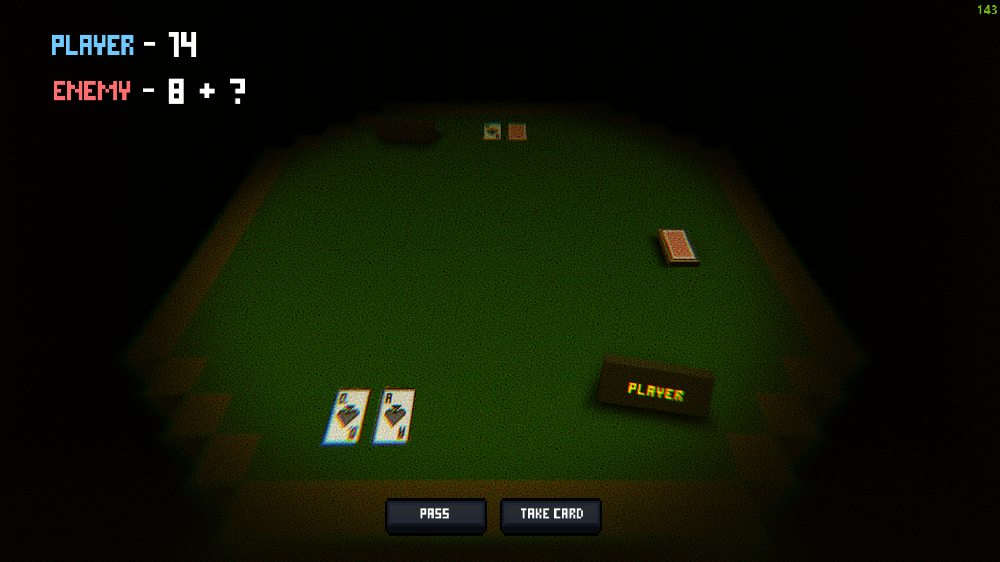
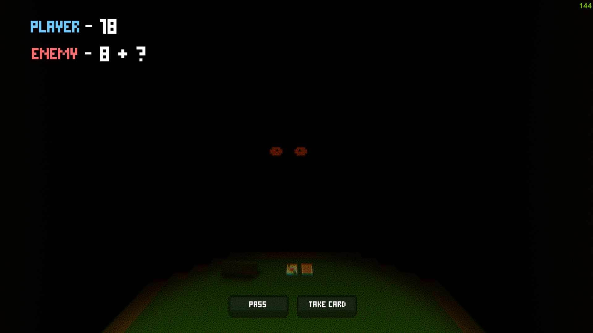

# Pixel-Blackjack

Pixel Blackjack is a simplified version of the card game Blackjack, the essence of which is to collect cards in your hands, the sum of which will be close to 21, but not exceeding this number.  Attention! Card denominations: From 6 to 10 correspond to their digital value.

**Jack - 2 points, Queen - 3 points, King - 4 points, Ace - 1 or 11 points.**

 

